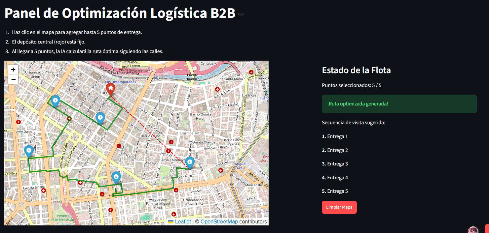

# 🚚 VRP Logistics Optimizer (MVP)

🔗 **[Try the Live Demo here](https://logistica-vrp.streamlit.app/)**

A functional prototype designed to solve the Vehicle Routing Problem (VRP) for last-mile logistics, specifically tailored for the city of **Lima, Peru**. The core value of this project is processing the urban road topology 100% locally using OpenStreetMap. This allows for accurate distance matrix calculations without relying on the variable costs of commercial APIs (such as Google Maps).

### 📍 How does this demo work?
The application flow is designed to be simple and interactive:
1. **Origin Point:** The route starts from the company's warehouse in Lima, represented on the map by a red marker with a white house icon labeled "depósito central" (central depot).
2. **Selecting Destinations:** Delivery points are added to the map by **double-clicking** on the desired locations.
3. **Automatic Optimization:** Upon selecting exactly the fifth delivery point, the software automatically calculates and plots the optimal route to visit all destinations using the real road network.

> **Project Status: Prototype / MVP.** 
> ⚠️ **Demo Warning:** Since this is a demo, the algorithm optimally processes topologies for points located within a few kilometers around the central depot in Lima. Selecting points that are too far away will generate errors or latency while memory load optimization for large-scale maps is still under development.

## 🏗️ Focus on Scalability
The system is designed with a modular architecture to facilitate its transition to production:
* **Separation of Concerns:** The frontend (visual interface) and backend (mathematical engine) are decoupled, allowing the routing logic to easily transform into an independent REST API.
* **Cloud-Ready (Docker):** The codebase is structured to be containerized, enabling rapid and scalable deployment.
* **Resource Efficiency:** Implementation of local graph caching to minimize network requests and significantly reduce recalculation times.

## 🛠️ Tech Stack
* **Language:** Python 3.10+
* **Spatial Processing:** OSMnx, NetworkX, Geopy (Nominatim).
* **Interface & Visualization:** Streamlit, Folium.
* **Mathematical Optimization:** Google OR-Tools.

## 🚀 Roadmap
1. **3D Bin Packing Module:** Integration of the LIFO Bin Packing problem with volumetric visualization of boxes inside the truck.
2. **Time Windows (VRPTW):** Adding strict delivery time constraints per customer.
3. **Dynamic Traffic:** Integration of a variable weight system in the graph to avoid real-time bottlenecks.
